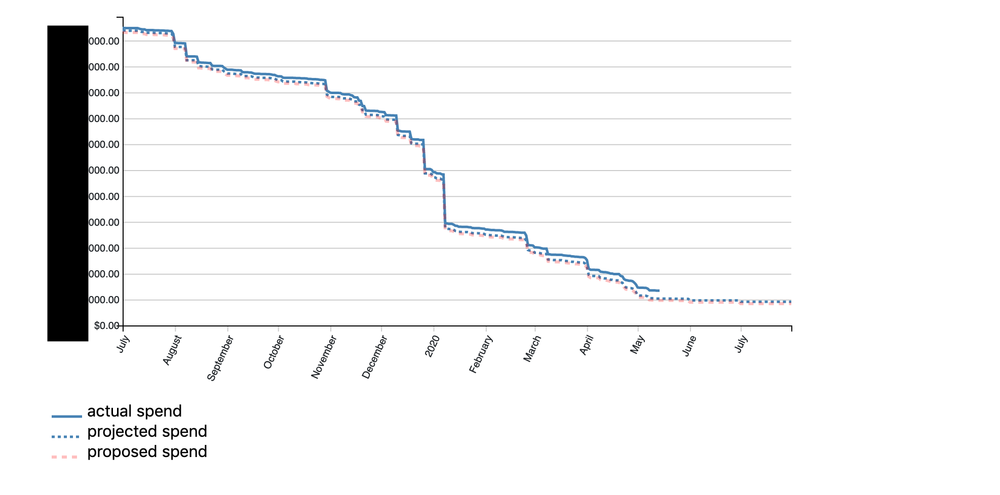
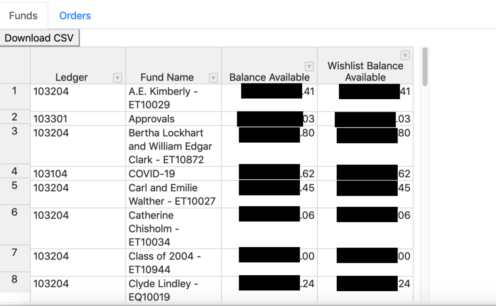
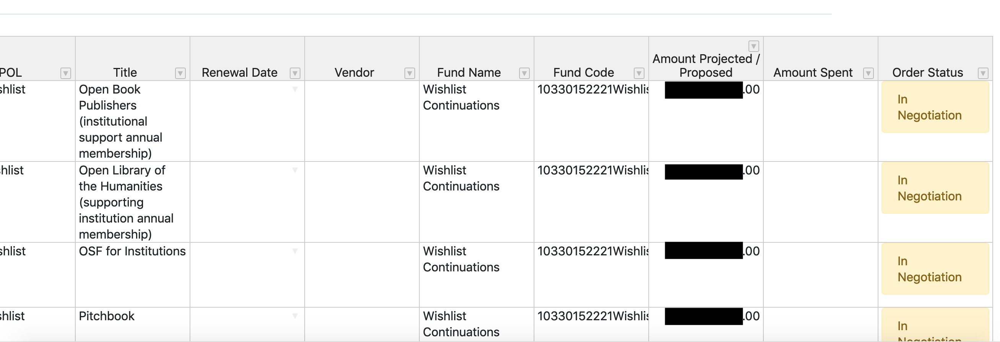

# Web App Using Alma and Airtable to Track Collections Spending (real and projected)

**Note: This application is currently under development.** The Airtable integration has worked decently well, but the Airtable interface has proven less than optimal for the needs of all stakeholders. I plan to redesign this app in the summer of 2020, with a goal of tracking more of this data in Alma itself. 

## Purpose 

Our collections teams maintain a prioritized "wishlist" of proposed acquisitions (journals, databases, etc.). Once items from the wishlist are selected for acquisition, there is typically a rather involved licensing and approval workflow that has to be completed before the order can be placed. At present, the items in that workflow are not tracked in Alma; a POL is not created until after the final approval (including license signatures and counter-signatures). Stakeholders have a need to track these intended/proposed acquisitions as part of the overall collections budget, with a focus on meeting spending targets.

The app provides a burndown chart showing actual (expenditures), projected (encumbrances), and proposed spend, combining information tracked in Airtable (for potential acquisitions in the licensing and approval workflow) with data from Alma Analytics. In addition, two tabular views show a) current fund balances, with and without the proposed spending, and b) order status, both for POL's recorded in Alma and for items in the workflow. 

## Architecture
- A postgres database provides a unified source of data from Alma and Airtable.
- A Python script, run nightly as a cron job, fetches the latest information from Alma Analytics (for funds and orders) and Airtable (for proposed acquisitions in the pipeline) via API and updates the local database.
- The app itself uses Node.js on the server side, D3.js for the visualization, and handsontable.js for the tabular views. JQuery provides some glue. 

## Installation
In lieu of installation instructions, given the status of this project, I invite you to contact me if you are interested in details of the setup, etc. 

